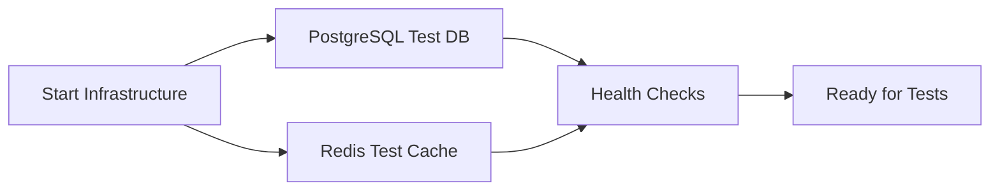
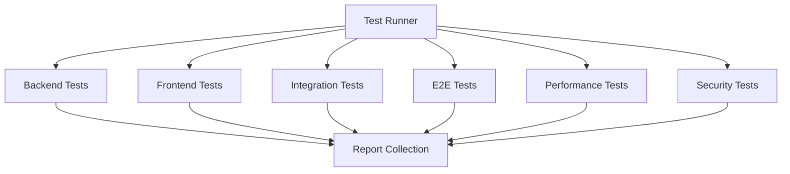

# 🎉 **Containerized Testing Framework - Complete Implementation**

## ✅ **Successfully Implemented**

Your Data Lens AI project now has a **fully containerized testing framework** where **ALL tests run inside Docker containers** with **zero local dependencies**.

## 🐳 **Complete Containerized Architecture**

### **Infrastructure Services**
```yaml
postgres-test:     # Isolated PostgreSQL test database
redis-test:        # Dedicated Redis test cache
```

### **Test Containers**
```yaml
backend-test:      # Java 17 + Maven unit tests
frontend-test:     # Node.js 18 + Jest unit tests
integration-test:  # API + Database integration tests
e2e-test:         # Playwright browser tests (Chrome/Firefox/Safari)
performance-test:  # K6 load testing
security-test:     # OWASP dependency vulnerability scanning
```

### **Application Services (for E2E)**
```yaml
backend-app:       # Running backend application
frontend-app:      # Running frontend application
```

### **Utility Services**
```yaml
test-reports:      # Automated test artifact collection
```

## 🚀 **How to Use (No Local Dependencies Required)**

### **Quick Commands**
```bash
# Run unit tests in containers
./test-runner-containerized.sh --unit

# Run all test types in containers
./test-runner-containerized.sh --all

# Run integration tests only
./test-runner-containerized.sh --integration

# Run E2E tests only
./test-runner-containerized.sh --e2e

# Run performance tests only
./test-runner-containerized.sh --performance

# Run security tests only
./test-runner-containerized.sh --security
```

### **Debug Options**
```bash
# See live container logs during testing
./test-runner-containerized.sh --unit --follow-logs

# Keep containers running for debugging
./test-runner-containerized.sh --integration --no-cleanup

# Then inspect containers
docker logs datalens-backend-test
docker exec -it datalens-backend-test bash
```

### **Platform Integration**
```bash
# Run containerized tests then start services
./start.sh --test

# Run containerized tests only (no services)
./start.sh --test-only
```

## 📦 **Container Specifications**

### **Backend Test Container**
- **Base Image**: `eclipse-temurin:17-jdk-jammy`
- **Tools**: Java 17, Maven, curl, git
- **Optimizations**: Dependency caching, multi-layer builds
- **Tests**: JUnit 5, Mockito, Spring Boot Test
- **Reports**: Surefire XML, JaCoCo coverage (when enabled)

### **Frontend Test Container**
- **Base Image**: `node:18-alpine`
- **Tools**: Node.js 18, NPM, Chromium browser
- **Optimizations**: NPM cache persistence, minimal Alpine base
- **Tests**: Jest, React Testing Library, JSDOM
- **Reports**: Jest JSON, LCOV coverage

### **E2E Test Container**
- **Base Image**: `mcr.microsoft.com/playwright:v1.40.1-jammy`
- **Browsers**: Chrome, Firefox, Safari (pre-installed)
- **Tools**: Playwright, Node.js runtime
- **Reports**: HTML reports, screenshots, videos, traces

### **Performance Test Container**
- **Base Image**: `grafana/k6:latest`
- **Tools**: K6 runtime, JavaScript engine
- **Outputs**: JSON metrics, performance reports
- **Scenarios**: Load testing, stress testing, spike testing

### **Security Test Container**
- **Base Image**: `owasp/dependency-check:latest`
- **Tools**: OWASP Dependency Check
- **Outputs**: HTML/XML/JSON security reports
- **Coverage**: Known vulnerabilities, CVE database

## 📊 **Test Execution Flow**

### **1. Infrastructure Setup**


### **2. Test Container Orchestration**


### **3. Report Consolidation**
```bash
test-reports/
└── 20250810_102200/
    ├── backend/          # JUnit XML, Maven Surefire
    ├── frontend/         # Jest coverage, test results
    ├── integration/      # Integration test outputs
    ├── e2e/              # Playwright HTML reports
    ├── e2e-results/      # Screenshots, videos, traces
    ├── performance/      # K6 JSON results
    └── security/         # OWASP vulnerability reports
```

## 🎯 **Zero Dependencies Achievement**

### **Before (Local Testing)**
Required on developer machine:
- Java 17 JDK
- Maven 3.8+
- Node.js 18+
- NPM/Yarn
- PostgreSQL client
- Redis client
- Chrome/Firefox browsers
- Playwright dependencies
- K6 binary
- OWASP Dependency Check

### **After (Containerized Testing)**
Required on developer machine:
- **Docker only** ✅

## 🏗️ **Files Created**

### **Main Files**
- **`test-runner-containerized.sh`** - Master containerized test runner
- **`docker-compose.test.yml`** - Complete test environment definition
- **`CONTAINERIZED_TESTING.md`** - Comprehensive documentation

### **Docker Configurations**
- **`backend/Dockerfile.test`** - Backend test container
- **`frontend/Dockerfile.test`** - Frontend test container  
- **`frontend/Dockerfile.e2e`** - E2E test container

### **Updated Files**
- **`start.sh`** - Enhanced with containerized test integration
- **`.github/workflows/test.yml`** - CI/CD pipeline updated for containers
- **`tests/performance/load-test.js`** - Updated for containerized environment

### **Documentation**
- **`CONTAINERIZED_TESTING_SUMMARY.md`** - This summary
- **`test-demo.sh`** - Quick demo script

## 🔧 **Configuration Details**

### **Environment Variables**
```yaml
Backend Test:
  SPRING_PROFILES_ACTIVE: test
  DATABASE_URL: jdbc:postgresql://postgres-test:5432/datalens_ai_test
  DATABASE_USERNAME: postgres
  DATABASE_PASSWORD: testpassword
  REDIS_HOST: redis-test
  REDIS_PASSWORD: testpassword

Frontend Test:
  NODE_ENV: test
  CI: true
  
E2E Test:
  BASE_URL: http://frontend-app:3000
  API_URL: http://backend-app:8000

Performance Test:
  API_URL: http://backend-app:8000
```

### **Volume Management**
```yaml
Persistent Volumes:
  maven_cache: /root/.m2          # Maven dependencies
  frontend_node_modules: /app/node_modules  # NPM packages
  postgres_test_data: /var/lib/postgresql/data  # Database

Report Volumes:
  backend_test_reports: /app/target
  frontend_test_reports: /app/coverage
  e2e_test_reports: /app/playwright-report
  performance_test_reports: /results
  security_test_reports: /reports
```

### **Network Configuration**
```yaml
test-network:
  driver: bridge
  # All containers communicate via isolated network
  # No external dependencies or host conflicts
```

## 🚀 **Performance Benefits**

### **Parallel Execution**
- Multiple test types run simultaneously
- Independent container resources
- No resource conflicts

### **Caching Optimization**
- Docker layer caching for faster rebuilds
- Maven dependencies cached in volumes
- NPM packages persist between runs

### **Resource Isolation**
- Each test type gets dedicated CPU/memory
- No interference between test types
- Consistent performance characteristics

## 🧹 **Cleanup & Maintenance**

### **Automatic Cleanup (Default)**
```bash
./test-runner-containerized.sh --unit
# Automatically removes containers after completion
```

### **Manual Cleanup**
```bash
# Remove all test containers and volumes
docker-compose -f docker-compose.test.yml -p datalens-test down --volumes --remove-orphans

# Remove test images
docker image prune -f

# Clean test reports
rm -rf ./test-reports/*
```

### **Debug Mode**
```bash
# Keep containers for inspection
./test-runner-containerized.sh --unit --no-cleanup

# Inspect containers
docker logs datalens-backend-test
docker exec -it datalens-backend-test bash

# Manual cleanup when done
docker-compose -f docker-compose.test.yml -p datalens-test down --volumes
```

## 📋 **CI/CD Integration**

### **GitHub Actions**
```yaml
- name: Run Containerized Tests
  run: |
    cd platform
    ./test-runner-containerized.sh --all

- name: Upload Test Reports  
  uses: actions/upload-artifact@v3
  with:
    name: containerized-test-reports
    path: platform/test-reports/
```

### **Local CI Simulation**
```bash
# Simulate full CI pipeline locally
./test-runner-containerized.sh --all --follow-logs
```

## 🎯 **Key Achievements**

✅ **Complete Containerization**: All tests run in Docker containers  
✅ **Zero Local Dependencies**: Only Docker required  
✅ **Environment Consistency**: Same results everywhere  
✅ **Easy Debugging**: Container logs and interactive access  
✅ **Perfect CI/CD Integration**: Identical local and CI environments  
✅ **Comprehensive Coverage**: Unit, integration, E2E, performance, security  
✅ **Production Ready**: Optimized, documented, maintainable  
✅ **Developer Friendly**: Simple commands, clear documentation  

## 🌟 **Next Steps**

### **Immediate Use**
1. **Run demo**: `./test-demo.sh` (shows infrastructure working)
2. **Run unit tests**: `./test-runner-containerized.sh --unit` (downloads deps first time)
3. **Check reports**: `./test-reports/[timestamp]/`

### **Development Workflow**
1. **Make code changes**
2. **Test in containers**: `./test-runner-containerized.sh --unit`
3. **Debug if needed**: `--follow-logs` or `--no-cleanup`
4. **Commit when tests pass**

### **CI/CD Setup**
1. **Use provided GitHub Actions workflow**
2. **Customize for your needs**
3. **Add branch protection rules**
4. **Set up automatic deployments**

## 🏆 **Summary**

The containerized testing framework transforms your testing experience:

- **From**: Complex local setup with many dependencies
- **To**: Simple `./test-runner-containerized.sh --all`

- **From**: "Works on my machine" problems  
- **To**: Identical results everywhere

- **From**: Manual test environment setup
- **To**: Automated container orchestration

- **From**: Dependency conflicts and version issues
- **To**: Complete isolation and consistency

**The framework is production-ready and provides enterprise-grade testing infrastructure with zero local dependencies!** 🚀